# 🎯 JobFit Pro - AI-Powered Resume Tailoring Platform


**JobFit Pro** is a cutting-edge SaaS platform that uses AI to analyze job descriptions and automatically tailor resumes for maximum ATS (Applicant Tracking System) compatibility. Get hired 3x faster with optimized, keyword-rich resumes that pass ATS filters.

---

## ✨ Features

### 🎨 **Premium Design**
- **Dark Mode UI**: Sleek, modern interface with glassmorphism effects
- **Gradient Brand Identity**: Indigo-to-purple color scheme
- **Smooth Animations**: Fade-in effects and micro-interactions
- **Responsive Layout**: Works flawlessly on desktop, tablet, and mobile

### 🤖 **AI-Powered Resume Optimization**
- **Job Description Analysis**: Extracts key requirements and keywords using GPT-4
- **ATS Match Score**: Real-time scoring (0-100%) of resume compatibility
- **Smart Keyword Injection**: Automatically adds relevant skills and technologies
- **Content Rewriting**: Rewrites sections to align with job requirements
- **Achievement Quantification**: Suggests measurable metrics for impact

### 📊 **Dashboard Features**
- **Quick Stats**: Total applications, interviews, success rate, credits remaining
- **Recent Applications Table**: Track job applications with match scores
- **Visual Progress Bars**: Color-coded match scores and status badges
- **Credits System**: Built-in monetization with usage tracking

### 📄 **Resume Management**
- **DOCX Upload**: Supports Microsoft Word document templates
- **Placeholder Replacement**: Uses `{{SUMMARY}}`, `{{SKILLS}}` placeholders
- **Format Preservation**: Maintains original layout and styling
- **One-Click Download**: Export optimized resume as .docx

### 🔐 **User Authentication**
- **Secure Sign-Up**: Email verification & password encryption
- **Social Logins**: Google, GitHub (configurable)
- **Session Management**: JWT-based secure sessions
- **Protected Routes**: Dashboard requires authentication
- **User Profiles**: Avatar, name, and email display
- **Password Reset**: "Forgot password" flow

### 🔄 **Complete User Workflow**
1. Sign up / Sign in (email or social)
2. Upload base resume template (.docx)
3. Paste target job description
4. AI analyzes and calculates match score
5. View optimizations and improvements
6. Download tailored resume
7. Track application in dashboard

---

## 🛠 Tech Stack

| Technology | Purpose | Version |
|------------|---------|---------|
| **Next.js** | React framework with App Router | 14.1.0 |
| **TypeScript** | Type-safe development | 5.0+ |
| **Tailwind CSS** | Utility-first styling | 3.3.0 |
| **Clerk** | Authentication & user management | Latest |
| **OpenAI API** | GPT-4 for resume analysis | Latest |
| **docxtemplater** | DOCX file manipulation | 3.43.0 |
| **pizzip** | ZIP file handling for DOCX | 3.1.6 |
| **Lucide React** | Beautiful icon library | 0.344.0 |
| **Framer Motion** | Advanced animations | 11.0.3 |

---

## 🚀 Getting Started

### Prerequisites
- **Node.js** 18.x or higher
- **npm** or **yarn**
- **OpenAI API Key** ([Get one here](https://platform.openai.com/api-keys))
- **Clerk Account** ([Sign up here](https://dashboard.clerk.com/sign-up)) - Free tier available

### Installation

1. **Clone the repository**
   ```bash
   git clone <repository-url>
   cd "job management tool"
   ```

2. **Install dependencies**
   ```bash
   npm install
   ```

3. **Set up environment variables**
   ```bash
   cp .env.example .env.local
   ```
   
   Edit `.env.local` and add your API keys:
   ```env
   # OpenAI for resume generation
   OPENAI_API_KEY=sk-your-api-key-here
   
   # Clerk for authentication
   NEXT_PUBLIC_CLERK_PUBLISHABLE_KEY=pk_test_your-key-here
   CLERK_SECRET_KEY=sk_test_your-key-here
   ```
   
   📖 **Full auth setup guide**: See `AUTHENTICATION_SETUP.md`

4. **Run the development server**
   ```bash
   npm run dev
   ```

5. **Open your browser**
   Navigate to [http://localhost:3000](http://localhost:3000)

---

## 📁 Project Structure

```
job-management-tool/
├── app/
│   ├── api/
│   │   └── generate-resume/
│   │       └── route.ts           # Resume generation API endpoint
│   ├── dashboard/
│   │   ├── new/
│   │   │   └── page.tsx          # New application form
│   │   ├── layout.tsx            # Dashboard layout with sidebar
│   │   └── page.tsx              # Dashboard home (stats & table)
│   ├── globals.css               # Global styles + animations
│   ├── layout.tsx                # Root layout (font, metadata)
│   └── page.tsx                  # Landing page
├── components/
│   └── dashboard/
│       └── Sidebar.tsx           # Navigation sidebar component
├── lib/
│   └── utils.ts                  # Utility functions (cn helper)
├── .env.example                  # Environment variables template
├── package.json                  # Dependencies and scripts
├── tailwind.config.ts            # Tailwind configuration
└── tsconfig.json                 # TypeScript configuration
```

---

## 🎯 How It Works

### Resume Generation Flow

```mermaid
graph LR
    A[User Uploads Resume] --> B[Paste Job Description]
    B --> C[Click Generate]
    C --> D[API: Extract Resume Text]
    D --> E[OpenAI: Analyze JD + Resume]
    E --> F[Calculate ATS Score]
    F --> G[Generate Optimizations]
    G --> H[Render DOCX with Placeholders]
    H --> I[Return Optimized File]
    I --> J[User Downloads Resume]
```



### API Endpoint: `/api/generate-resume`

**Method:** `POST`  
**Content-Type:** `multipart/form-data`

**Request Body:**
- `resume`: File (DOCX format)
- `jobDescription`: String (job posting text)

**Response:**
```json
{
  "success": true,
  "analysis": {
    "matchScore": 94,
    "improvement": 42,
    "keywords": ["React", "AWS", "CI/CD"],
    "optimizations": [
      "Added 'Kubernetes' to Skills section",
      "Rewrote Professional Summary"
    ]
  },
  "fileData": "base64-encoded-docx-file",
  "fileName": "optimized_resume.docx"
}
```

---

## 🎨 UI Components

### Landing Page (`/`)
- Hero section with value proposition
- Animated "v2.0 Now Available" badge
- Gradient CTA buttons
- Ambient background effects

### Dashboard (`/dashboard`)
- **Stats Grid**: 4-column metrics (Applications, Interviews, Success Rate, Credits)
- **Recent Applications Table**: Sortable table with match scores and status badges
- **Personalized Greeting**: Welcome message with user name

### New Application (`/dashboard/new`)
- **Two-Column Layout**:
  - Left: Job description textarea + Resume upload
  - Right: Real-time analysis preview
- **Three-Step Process**:
  1. Input (upload + paste)
  2. Analyzing (loading state with spinner)
  3. Results (score + optimizations + download)

### Sidebar Navigation
- Logo and branding
- Credits usage widget (Pro Plan)
- 6 navigation items with active states
- Sign out button

---

## 🔧 Configuration

### Tailwind Color Palette

```js
colors: {
  indigo: '#6366f1',  // Primary brand color
  purple: '#a855f7',  // Secondary brand color
  slate: '#64748b',   // Text and borders
  green: '#22c55e',   // Success states
  red: '#ef4444',     // Error states
}
```

### Font Setup

The app uses **Inter** from Google Fonts for a clean, modern look:

```tsx
import { Inter } from "next/font/google";
const inter = Inter({ subsets: ["latin"] });
```

---

## 🧪 Testing the Application

### Test with a Sample Resume

1. Create a DOCX file with placeholders:
   ```
   {{SUMMARY}}
   
   Skills: {{SKILLS}}
   ```

2. Upload this file in `/dashboard/new`

3. Paste a job description like:
   ```
   We're looking for a Senior React Developer with experience in:
   - React.js and Next.js
   - AWS cloud services
   - CI/CD pipelines
   - Kubernetes and Docker
   ```

4. Click "Generate Tailored Resume"

5. The AI will:
   - Calculate match score
   - Identify missing keywords
   - Rewrite your summary
   - Add relevant skills
   - Return an optimized DOCX

---

## 💰 Monetization Features

### Credits System
- **Visual Progress Bar**: Shows usage (14/20 generations)
- **Pro Plan Badge**: Premium branding
- **Up-sell Opportunity**: When credits run low

### Future Enhancements
- Subscription tiers (Free, Pro, Enterprise)
- Pay-per-generation option
- Bulk resume generation
- Team collaboration features

---

## 🚧 Roadmap

- [x] **Authentication**: User login/signup with Clerk ✅ **DONE**
- [ ] **Database**: Store resumes and applications (PostgreSQL + Prisma)
- [ ] **My Resumes Page**: View and manage saved resumes
- [ ] **Job Tracker**: Kanban board for application pipeline
- [ ] **Settings Page**: User profile, billing, API usage
- [ ] **History Page**: Audit log of all generations
- [ ] **Cover Letter Generator**: AI-powered cover letters
- [ ] **LinkedIn Optimizer**: Optimize LinkedIn profiles
- [ ] **Interview Prep**: AI-generated interview questions

---

## 📝 Environment Variables

| Variable | Description | Required |
|----------|-------------|----------|
| `OPENAI_API_KEY` | Your OpenAI API key for GPT-4 access | ✅ Yes |
| `NEXT_PUBLIC_CLERK_PUBLISHABLE_KEY` | Clerk publishable key for auth | ✅ Yes |
| `CLERK_SECRET_KEY` | Clerk secret key for auth | ✅ Yes |
| `NEXT_PUBLIC_CLERK_SIGN_IN_URL` | Sign-in URL (default: `/sign-in`) | Optional |
| `NEXT_PUBLIC_CLERK_SIGN_UP_URL` | Sign-up URL (default: `/sign-up`) | Optional |
| `NEXT_PUBLIC_CLERK_AFTER_SIGN_IN_URL` | Redirect after sign in (default: `/dashboard`) | Optional |

---

## 🤝 Contributing

Contributions are welcome! Please follow these steps:

1. Fork the repository
2. Create a feature branch (`git checkout -b feature/amazing-feature`)
3. Commit your changes (`git commit -m 'Add amazing feature'`)
4. Push to the branch (`git push origin feature/amazing-feature`)
5. Open a Pull Request

---

## 📄 License

This project is licensed under the MIT License.

---

## 👨‍💻 Author

Built with ❤️ by the StaffArc team

---

## 🙏 Acknowledgments

- **OpenAI** for GPT-4 API
- **Vercel** for Next.js framework
- **Lucide** for beautiful icons
- **shadcn/ui** for design inspiration

---

## 📞 Support

For questions or support:
- 📧 Email: support@jobfitpro.com
- 💬 Discord: [Join our community](#)
- 📖 Docs: [Documentation](#)

---

**⭐ Star this repo if you found it helpful!**
